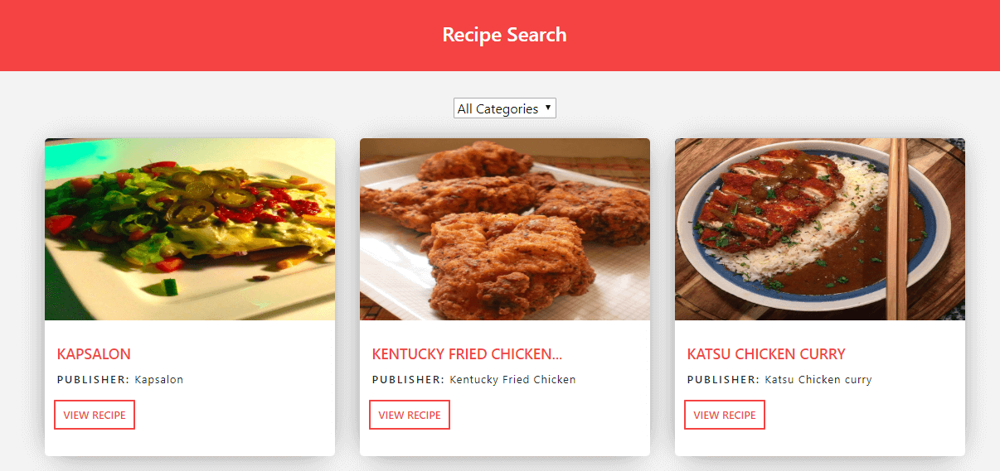

# capstone-project-react-redux

<!-- TABLE OF CONTENTS -->
## Table of Contents

* [About the Project](#about-the-project)
  * [Built With](#built-with)
  * [Prerequisites](#prerequisites)
* [Credit](#credit)
* [Screenshots](#screenshots)
* [Usage](#usage)
* [Live Version](#live-version)
* [Testing](#testing)
* [License](#license)

## About The Project

A single page application built with react which fetches information about different meal recipes and displays them in a catalogue.

## Built With

- Create-react-app
- Redux
- React-Router
- Webpack
- Babel
- HTML / CSS

## Prerequisites
 - Git
 - Yarn
 - Node.js
 - NPM

## Credit

👤 **Brham Dev Mahato**

-   Github: [@dev1980](https://github.com/dev1980)
-   Twitter: [@MahatoBrham](https://twitter.com/MahatoBrham)
-   Linkedin: [linkedin](https://www.linkedin.com/in/dev1980/)
-   <brham1980@gmail.com>
-   <https://brhamresume.netlify.com/>

## Screenshots

## Usage

- git clone https://github.com/dev1980/capstone-project-react-redux.git

- cd React-Redux-Capstone

- npm install

- npm start

## Testing

- git clone https://github.com/dev1980/capstone-project-react-redux.git

- cd React-Redux-Capstone

- npm install

- npm run test to run the test suites

## Live Version

[Live Demo Link](https://capstone-react-redux-app.herokuapp.com/)

## 🤝 Contributing

Contributions, issues and feature requests are welcome!

Feel free to check the [issues page](https://github.com/dev1980/capstone-project-react-redux/issues)

## Show your support

Give a ⭐️ if you like this project!

## 📝 License

This project is [MiT](https://opensource.org/licenses/MIT) licensed.